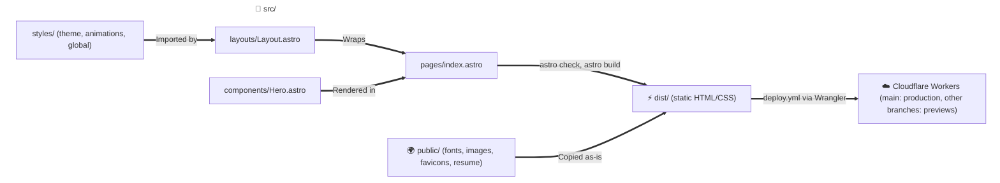

# System Architecture

## Overview

This portfolio is a statically generated site built with Astro and Tailwind CSS v4. Every page is pre-rendered at build time into static HTML and CSS, and no client-side JavaScript ships. GitHub Actions deploy the build to Cloudflare Workers as static assets.

## Architecture Flow

## 1. Pages and Components

- **`src/pages/index.astro`**: The only route (`/`). It renders `Hero` inside `Layout`.
- **`src/layouts/Layout.astro`**: The HTML shell: `title` and `description` props with defaults, Open Graph tags, the SVG favicon, and the `global.css` import.
- **`src/components/Hero.astro`**: The hero section: availability badge, headline, role, summary, and email and GitHub links.

## 2. Styling

Tailwind CSS v4 runs through the `@tailwindcss/vite` plugin registered in `astro.config.mjs`; there is no `tailwind.config.*` file.

- **`src/styles/theme.css`**: Design tokens in an `@theme` block (colors, fonts, radius, page width, easing, breakpoints). Each token is a CSS variable on `:root` and drives a Tailwind utility.
- **`src/styles/animations.css`**: Keyframes exposed as `animate-*` utilities, the `[data-reveal]` scroll transition, and reduced-motion rules.
- **`src/styles/global.css`**: Imports Tailwind and both files above, declares `@font-face` rules for the self-hosted fonts, and sets base element styles.

## 3. Static Assets

`public/` is served as-is: the self-hosted Montserrat and JetBrains Mono variable fonts with their licenses, the avatar and Open Graph image, the SVG and ICO favicons, and the resume PDF.

## 4. Rendering

The site is pre-rendered at build time (SSG). `npm run build` runs `astro check` (strict TypeScript) and then `astro build`, writing static HTML and CSS to `dist/`.

## 5. Tooling

- **Formatting:** Prettier with the Astro plugin (`npm run format`, `npm run format:check`).
- **CI:** `.github/workflows/ci.yml` runs the format check, type check and build on pull requests into `main`; `deploy.yml` also runs it on every push.
- **Deploy:** `.github/workflows/deploy.yml` runs on every push to a branch and calls `ci.yml` first. Once that passes, the deploy job builds the site and runs the official Wrangler action with Wrangler 4.147.0:
  - `main`: `wrangler deploy` to production.
  - Other branches: `wrangler versions upload --preview-alias <alias>`, served at `<alias>-adioz-dev.<subdomain>.workers.dev`. The alias is the branch name as a DNS label: lowercase letters, digits and dashes, starting with a letter, at most 53 characters.
  - The job authenticates with the `CLOUDFLARE_API_TOKEN` and `CLOUDFLARE_ACCOUNT_ID` repository secrets and writes the deployment URL to the run summary.
  - Runs for the same branch share a concurrency group: a newer push cancels an in-progress preview run, and `main` runs queue.
- **Wrangler:** `wrangler.toml` configures the `adioz-dev` Cloudflare Worker to serve `dist/` as static assets and enables Version URLs (`preview_urls`) for preview uploads; `npx wrangler dev` serves the build locally.
