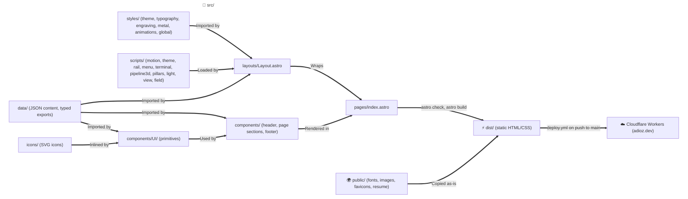

# System Architecture

## Overview

This portfolio is a statically generated site built with Astro and Tailwind CSS v4. Every page is pre-rendered at build time into static HTML and CSS; the only client-side JavaScript is a pre-paint theme script in `<head>` and short scripts for the theme knob, the header rail, the mobile menu, the agent log, the about pillars, motion effects, the pointer light, the view turn and the particle field, plus the hero's 3D agent pipeline (Three.js), loaded after first paint; every section is complete without them. GitHub Actions deploy `main` to Cloudflare Workers as static assets, served at `adioz.dev`. The colors follow the device's light or dark color scheme until the visitor picks a theme with the header's theme knob.

## Architecture Flow

## 1. Pages, Components and Data

- **`src/pages/index.astro`**: The only route (`/`). It renders `Header`; `Hero`, `AboutSection`, `TechStackSection`, `ExperienceSection`, `ProjectsSection` and `ContactSection` inside `<main>`; and `Footer`, all inside `Layout`.
- **`src/layouts/Layout.astro`**: The HTML shell. Its `title`, `description`, `image` and `imageAlt` props default to `profile.json` (title `<name> | <role>`) and `site.json`; `field` (off by default) renders `ParticleField` behind the page. It sets the canonical URL and the Open Graph and Twitter card tags as absolute URLs from `site` in `astro.config.mjs`, a `theme-color` for each color scheme (marked with `data-theme-color`), preloads the Montserrat and JetBrains Mono fonts, links the SVG and ICO favicons, imports `global.css`, inlines `src/scripts/theme-init.js` at the end of `<head>`, renders `EngravingFilters` at the start of `<body>`, and loads `src/scripts/motion.ts` and, for fine pointers without reduced motion, the pointer light from `src/scripts/light.ts` and the view turn from `src/scripts/view.ts`.
- **`src/components/Header/`**: The site header, built from `navigation.json` and `profile.json`:
  - `Header.astro`: the main design's header, fixed at the top of the page, with `.header-space` keeping its height in the page flow. It holds the brand link, the rail of section links (from 980px), the theme knob, the contact link ("Get in touch") as a slim machined accent `Button`, 34px tall on a 2px wall with a 24px cap (from 560px), and the menu knob (below 980px). While the page is within 40px of the top (`data-at-top`, set by `motion.ts`) it is clear; past it the header is stuck: frosted glass (`--nav-fill`) fades in, it tightens from 68px to 60px, and a steel hairline shows under it, filled with gold by the page's scroll position where scroll timelines are supported. Its script starts the scroll spy over the rail and the menu drawer, and the rail.
  - `BrandLogo.astro`: a link to the top of the page with the Dividers mark alone (`BrandMark`), named "adioz.dev, back to top". The link keeps a 48px box in the header's row; while the page is at its top the mark is drawn at 96px (68px below 760px) from the box's top, hanging below the header into the hero, and once the header is stuck it shrinks into the bar. The mark's dividers open on load and spread while the link is hovered or focused; with reduced motion they do not open.
  - `NavLinks.astro`: the section links as the header's rail of clear glass lying flat, with one key cap per link and the gold `.rail-plate` that travels between them (driven by `src/scripts/rail.ts`).
  - `ThemeToggle.astro`: the theme knob, a compact `Knob` whose face shows the theme a press switches to (the sun on the dark theme, the moon on the light one). Its accessible name is whichever of its two visually hidden labels ("Switch to light theme", "Switch to dark theme") matches `data-theme`, so it needs no script; a press calls `toggleTheme` from `src/scripts/theme.ts`. Without JavaScript the knob is hidden.
  - `MobileMenu.astro`: the phone menu below 980px: a compact menu `Knob` and the menu sheet, an HTML popover, a brushed gunmetal case dark in both themes that drops from under the header. The sheet lists every section and the contact link, each with its section number (from `sectionNumber`) engraved and hidden from assistive technology; the current section (`aria-current`, from the scroll spy) is gold. While closed the sheet is not rendered, so keyboard and screen-reader users cannot reach its links; `Escape` or a tap outside closes it, and `src/scripts/menu.ts` closes it when a link is chosen or the viewport widens to 980px, and names the knob for what a press does (`menuLabel.open` or `menuLabel.close`) with its state in `aria-expanded`.
- **`src/components/Hero/`**: The first screen, built from `profile.json`, `pipeline.json`, `terminal.json` and `stats.json`:
  - `Hero.astro`: the availability pill (a gold-rimmed `Panel` led by the status `Lamp`), the name and headline in gold (`.gilt` in `.display`), the lede (the role and specialty, then the summary), the actions (View selected work and Get in touch as accent `Button`s whose cap icons turn toward the pointer, and the résumé `Knob`, which downloads `/resume.pdf` under the file name in `profile.json`), and the `StatBanner` panel, beside the 3D pipeline and the agent log under it from 1020px.
  - `Pipeline3D.astro`: the agent pipeline, one island in a figure named by `pipeline.label`. Its markup is a flat diagram of the `pipeline.json` parts on small machined `Panel`s (the guardrail's rimmed in gold) joined by wires, the image shown without JavaScript or WebGL. After first paint, when the browser is idle and a WebGL context can be created, its script imports `src/scripts/pipeline3d.ts`, a chunk of its own with Three.js; once the scene's first frame is drawn (`data-ready` on the stage) the canvas and the parts' labels fade in over the flat diagram. On the light theme a faint white spotlight sits behind the parts.
  - `Terminal.astro`: the agent log, dark in both themes: a brushed gunmetal case on a slab wall with its title engraved in the title bar beside the window buttons (close, minimise, zoom in the macOS colours) and the word `live` beside the red live `Lamp`, over a screen sunk into the case. The markup holds every `terminal.json` entry, a writer and a message toned good (gold) or bad (ember), and renders the window buttons disabled; `src/scripts/terminal.ts` types the entries in and enables the buttons. Below 560px entries drop their clock times. The log is the only text set in JetBrains Mono.
- **`src/components/About/`**: The about section, the main design's Core Engineering Focus, built from `about.json`:
  - `AboutSection.astro`: a `SectionTitle` (the gold headline and the bio), then the pillars on one brushed instrument `Plate` screwed down at its corners: the portrait as pillar 00, then a `CoreFocusCard` per pillar, the middle one's coin gold. They sit four to a row from 1180px, two from 700px and stacked below, split by grooves cut into the plate. Under the plate, the service record: a brushed steel plaque, the same in both themes, screwed down at its corners, its four traits each an engraved word over a stamped line, two to a row below 700px. Its script starts `startPillarFocus` on the pillars and `startCords` on the portrait.
  - `CoreFocusCard.astro`: one pillar: a steel bezel holding its coin icon (gunmetal, or gold), the number and title carved into the plate, the description in dark ink and its `Tag`s. The coin is a smoked lens over a bulb: while the pillar is hovered, holds focus or is `.lit`, the bulb flickers on, lights the lens from inside and backlights the icon; under reduced motion it fades on without the flicker.
  - `AboutPortrait.astro`: pillar 00, `profile_pic.svg` engraved into the plate by its `#portrait-cut` filter (the drawing's darkness sets the cut's depth, over a shaded floor and a dark upper rim), cropped from the top right to fill the pillar (as tall as its row; up to 560px, about 4:5, on a single column). On it, named once for assistive technology by `about.portrait.alt`: the Dividers mark beside the head (1.8 times larger on a single column), which spreads while the pillar is hovered or `.lit`; the gold "CODE / TRAIN / SHIP / EST 2018" chest print, placed by the pillar's aspect ratio through container queries so the crop never cuts it; and two brass drawstrings with steel aglets that sway at rest.
- **`src/components/TechStack/`**: The tech stack section, built from `techStack.json`:
  - `TechStackSection.astro`: a `SectionTitle` (the gold headline and the intro), then the kit: the gauge cluster (a `Gauge` per skill on one brushed `Plate` screwed down at its corners) and a `TagCloud` per tool category. Below 1000px the cluster sits above the categories, its gauges wrapping into centred rows (128px dials, two to a row, up to 640px); from 1000px it is a 380px vertical strip beside the categories, each gauge a row of its 128px dial and its label, which on screens at least 900px tall stays in view below the header while the categories scroll. Its script starts `startGauges` on the cluster.
  - `Gauge.astro`: a skill as a `<dt>`/`<dd>` pair: its label, cut into the plate, under a dial (shown first): a steel bezel seated in the plate holding a face with 21 raised ticks across a 270deg scale, the gold arc (`#dial-gold`) in an engraved groove, the needle on its spun hub, and the readout inlaid into the face (the number in gold above the hub, the level in steel below it), under a glass crystal. The markup seats the needle and arc on the skill's percent, so the dial reads right without JavaScript. The dial is hidden from assistive technology, which reads the level from a visually hidden copy.
  - `TagCloud.astro`: a category's name as an `<h3>` in gold mono capitals behind a short rule, over its tools as machined `Tag`s. Hovering the category lengthens and lights the rule, lifts the heading to `--text` and brightens the tags; a hovered tag rings in gold.
- **`src/components/Experience/`**: The experience section, built from `experience.json`:
  - `ExperienceSection.astro`: a `SectionTitle` (the gold headline) over two views of the roles, picked by the view switch (a group of Trace and Timeline buttons with `aria-pressed`, shown by the script, which sets `data-view` on the section): the `CareerTrace`, and the timeline, an `<ol>` named by `timelineLabel` with an `ExperienceItem` per role, most recent first, down a steel rail that fills with gold. Without the script only the timeline shows. `src/scripts/timeline.ts` spans the rail between the first and last rivets and fills it down to a reading line as the page scrolls; without it the rail runs from the first rivet to the end of the list, filled.
  - `CareerTrace.astro`: the career trace, a smoked gunmetal window dark in both themes (`.slab-dark`, with gunmetal tags): a title bar with three steel studs, the engraved title, the span count and the red live `Lamp`; a year axis from the earliest start to the year after the build's date, with a dashed now marker; a `tablist` with one tab per role, earliest first (`traceOrder`), its company and title beside a track holding its brushed steel span (gold and pulsing for the ongoing role); and a `tabpanel` per role with its years, title, company, highlights and technologies, the ongoing role's selected and the others hidden. The scale is laid out at build time by `traceLayout`. Below 760px each name sits above its track.
  - `ExperienceItem.astro`: a role as a stop: a rivet on the rail (spun steel, ringed in gold once the fill has reached it; gold and pulsing for the ongoing role) and its card on a machined `Panel`: its years in `<time>` elements engraved on a plate (an ongoing role ends with `ExperienceContent.ongoing`; a role within one year shows that year alone), its title, company and location, and its technologies as `Tag`s, beside its highlights, each led by a short gold rule and rendered with `Emphasis`. The card stacks up to 860px.
- **`src/components/Projects/`**: The featured projects section, built from `projects.json`:
  - `ProjectsSection.astro`: the section at `#projects`: a `SectionTitle` (the gold headline) over a `ProjectCard` per project with `featured` set, two to a row from 860px, with the page glowing behind them (gold low behind the first card, steel high behind the second, in `--backlight-*`). Its script starts `startTilt` on each card.
  - `ProjectCard.astro`: a project on a machined `Panel` (`data-tilt`): its name carved into a screwed `Nameplate`, its links as `Port`s, its description, which grows so the cards in a row align their tags and result lines, its `Tag`s, and its result line under a hairline beside the gold status `Lamp`, rendered with `Emphasis`.
- **`src/components/Contact/ContactSection.astro`**: The contact section from `contact.json`: a `SectionTitle` (the gold headline) over one machined `Panel` holding the lead; the email address carved into a screwed `Nameplate` that opens `profile.email`; the compact copy `Knob`, rendered hidden and shown by `src/scripts/copy.ts`, with its status note; and a `Port` per `contact.json` link (GitHub, LinkedIn, Tech articles), then the résumé port, which downloads `profile.resume` under its file name. The ports sit beside the lead behind a hairline from 860px and in a row under it below.
- **`src/components/Footer/Footer.astro`**: The site footer from `footer.json`: `©`, the build year and the copyright statement, then each credit group and the source link, with their icons. The items stack below 760px and share one line, separated by `·`, from 760px. The links are underlined and open in a new tab.
- **`src/components/UI/`**: Reusable primitives that render static HTML:
  - `Button.astro`: a `primary` (cyan-to-violet gradient) or `ghost` (outlined) button with an optional trailing icon, or a main design machined slab, `accent` (brushed gold on the dark theme, bronze on the light one) or `steel`: a brushed face with a highlight band at `--lx`, a stepped wall `--wall` deep (5px unless set) slanted by `--lean`, an engraved label, and, with an `icon`, a spun steel cap holding it engraved (`data-rest` gives its angle at rest). `compact` sets the nav's size. Hover lifts a machined button 2px and press sinks it by three fifths of its wall; hover and focus light the cap's icon in `--accent-line`. With `href` it renders an `<a>`, and `external` opens the link in a new tab with `rel="noopener noreferrer"`; without `href` it renders a `<button>` whose `type` defaults to `button`.
  - `Badge.astro`: a `tag` (outlined label), `chip` (tool label) or `status` (pill with a pulsing success dot).
  - `EngravingFilters.astro`: the main design's SVG filters and gradients in one hidden, zero-size SVG that `Layout.astro` renders once per page: `#engrave` (small shapes cut into metal), `#carve` (large text cut into a plate), `#dial-groove` (a gauge arc shaded by its cut's upper wall), `#dial-raise` (gauge ticks standing off the face), `#dial-gold` (a gauge arc from deep to pale gold in the theme's `--dial-gold-*` stops), and the Dividers mark's `#mark-steel` and `#mark-gold` (the theme's metals, from `--mark-steel-*` and `--mark-gold-*`), `#mark-steel-bright` and `#mark-gold-bright` (the dark theme's metals in both themes) and `#mark-raise` (the mark standing off the page).
  - `BrandMark.astro`: the Dividers mark alone, an "A" drawn as steel dividers hinged on a gold pivot with the gold arc as its crossbar, as an inline SVG named by `label` (`adioz.dev` by default; an empty label hides it). It takes the theme's metals, which follow `data-theme` on `<html>`, or with `bright` the dark theme's metals for dark metal such as the footer strip; `size` sets its width and height (36px). `--spread` on it or an ancestor opens its legs by that many degrees each.
  - `Emphasis.astro`: renders text with each `**` pair as `<strong>`; an unpaired `**` fails the build.
  - `Knob.astro`: the main design's round steel knob: a chamfered bezel on a 6px wall (3px when `compact`, 36px across instead of 62px) around a spun face holding an engraved `icon`, or the default slot's content. It renders an `<a>` with `href`, otherwise a `<button>` of type `button`; `label` is its accessible name, or a `label` slot outside the hidden face names it; with `rest`, its icon turns toward the pointer. Hover lifts it, press sinks it, and hover and focus light its icon in `--accent-line`.
  - `Icon.astro`: inlines `src/icons/<name>.svg` at a given pixel size. The icon is hidden from assistive technology unless it has a `label`, and a name with no SVG file fails the build.
  - `StatCard.astro`: one `stats.json` entry as a `<dt>` label and a `<dd>` value in polished gold (`.gilt`) with its suffix, shown value first. The number carries `data-count` and `data-decimals` for the counter in `motion.ts`.
  - `StatBanner.astro`: a machined `Panel` rendered as a `<dl>` of `StatCard`s, every `stats.json` entry by default, in one row with a column per stat split by `--line` rules.
  - `Panel.astro`: the brushed slab every card sits on (a `.slab`; `as` sets its element, `div` by default): gunmetal on the dark theme and satin aluminium on the light one, under brushing streaks and a highlight band at `--lx`, with a lit top lip, a chamfered 1px rim in `--steel-edge` (`--gold-edge` with `gold`, for featured cards), a 6px wall (5px up to 640px) and the slab's shadows, lifted on hover. A white glow of strength `--glow` times `--near` sits at `--glow-x`, `--glow-y`; with `--near` unset it is off.
  - `ParticleField.astro`: the particle field's one fixed canvas, behind the whole page, hidden from assistive technology and transparent to the pointer; its script starts `src/scripts/field.ts` on it.
  - `Plate.astro`: the brushed plate that carries carved text: brushed gold on the dark theme and bronze on the light one (`--plate-metal`) under a highlight band at `--lx`, on a 6px stepped wall slanted by `--lean`, screwed down at its four corners (`screws`, true by default). `as` sets its element (`div` by default).
  - `Port.astro`: a link port: a spun steel cap with the link's engraved icon, then the label. Hovering or focusing it lights the icon in `--accent-line` and underlines the label in gold. An `https:` link opens in a new tab and says so through a visually hidden `site.newTab`; `download` saves the linked file under a name. The project cards and the contact section use it.
  - `Nameplate.astro`: a narrow plate on a 4px wall, screwed down at both ends, with its `name` carved in (`.carved`): a heading (`level`, 3 by default), or, with `href`, a link that lifts 1px on hover.
  - `Screw.astro`: an 11px spun steel screw head with its slot at `angle` degrees, hidden from assistive technology and placed by its parent.
  - `Tag.astro`: a small machined tag (a `span`, or an `li` with `as="li"`): a brushed face on a 2px wall slanted by `--lean`, gunmetal on the dark theme and satin aluminium on the light one, its label in JetBrains Mono; hover rings it in gold.
  - `Lamp.astro`: a decorative lamp in a dark socket, hidden from assistive technology: the gold `status` lamp, whose glow breathes, or the red `live` lamp, which blinks. With reduced motion both stay lit.
  - `Section.astro`: a numbered page section: the `<section>` with its id and accessible name, the page-width container, and a `SectionHeader` numbered by `sectionNumber`, with the paragraphs of its `intro` slot under the title.
  - `SectionHeader.astro`: a section's number and name (for example `01 — Core Engineering Focus`), its `<h2>` title and an optional intro, given as a string or as paragraphs in its default slot; `align="center"` centres it.
  - `SectionTitle.astro`: a main design section's title: the `.eyebrow` with the section number (from `sectionNumber`) engraved into its `.eyebrow-no` plate and the label, the headline in gold (`.gilt` in `.h2`) with the given id, and the default slot's intro paragraphs, when given.
- **`src/icons/`**: One SVG per icon name used in the data (`LinkItem.icon`). Each file keeps only its path data, filled with `currentColor`, so an icon takes the color of the text around it. `LICENSE.md` lists the sources: Bootstrap Icons (MIT) and Simple Icons (CC0).
- **`src/data/types.ts`**: TypeScript interfaces for the portfolio content: profile, header navigation, stats, terminal lines, about, tech stack, experience, projects, contact and footer. Every type holds JSON-compatible values only, and every link is a `LinkItem` with a title, URL and icon name. In `Profile.summary` and `ExperienceItem.highlights`, text inside `**` pairs marks strong emphasis, which `Emphasis.astro` renders.
- **`src/data/*.json`**: The portfolio content, one file per type: `profile.json` (`Profile`: the name, role, hero copy, the action links, the résumé link with its accessible name and download file name, and the email address as a `mailto:` link), `navigation.json` (`Navigation`: the section links, the contact link and the accessible names of the navigation landmarks and of the menu knob while the sheet is closed and open), `stats.json` (`StatItem[]`, the only place the headline metric values live), `pipeline.json` (`PipelineContent`: the pipeline figure's accessible name and each part's title and detail), `terminal.json` (`TerminalContent`: the title, the window name used in the buttons' accessible names, the live word, and the log entries), `about.json` (`AboutContent`: the section id and label, the headline, bio, the portrait's file and text alternative, pillars with their icons, and the service record's caption and traits), `techStack.json` (`TechStack`: the section id, label, headline and intro, the skills with their levels and percents for the gauges, and tools grouped by category), `experience.json` (`ExperienceContent`: the section id, label and headline, the timeline's accessible name, the view switch's labels, the trace window's title, tab list name and axis and lamp words, the text for an ongoing role's end year, and the roles), `projects.json` (`ProjectsContent`: the section id, label and headline, the words read after a link that opens in a new tab, and the projects), `contact.json` (`ContactContent`: the section id, label and headline, the lead, the copy knob's name and status notes, the link ports and the résumé port's label), `footer.json` (`FooterContent`) and `site.json` (`SiteMeta`: the default meta description and Open Graph image, and the words read after a link that opens in a new tab). The experience, projects, stats and tech stack categories follow the resume in `public/resume.pdf`.
- **`src/data/index.ts`**: Exports each JSON file typed by its interface, so `astro check` (run by `npm run build` and CI) rejects a file whose structure no longer matches. JSON imports type strings as `string`, so it checks `TerminalLine.tone` when it loads and throws on an unknown tone; it also throws on a skill percent that is not an integer from 0 to 100. `Layout.astro` imports `profile` and `site` from it, so either error fails the build. It also exports `sectionNumber(id)`, a section's position among the `navigation.json` links from 1, which throws when no link targets the section.

## 2. Styling

Tailwind CSS v4 runs through the `@tailwindcss/vite` plugin registered in `astro.config.mjs`; there is no `tailwind.config.*` file.

- **`src/styles/theme.css`**: Design tokens in an `@theme` block (colors, fonts, radius, page width, header height, easing, breakpoints). Each color token is `light-dark(light, dark)`, resolved by the `color-scheme` of the element using it: `:root[data-theme="dark"]` and `:root[data-theme="light"]` set it from the theme, and `[data-scheme="dark"]` keeps an element dark in both themes. With no `data-theme` (JavaScript off) `global.css`'s `color-scheme: light dark` follows the device. Text colors meet WCAG AA (4.5:1) in both schemes. Each token is a CSS variable on `:root` and drives a Tailwind utility.
  Beside them, as plain CSS variables read with `var()`, are the main design's tokens:
  - colours (`--bg`, `--text`, `--body`, `--label`, `--gold-text`, `--ember`), the hairline between parts of a panel (`--line`), metal text's shadow and title sheen (`--text-shadow`, `--title-sheen`, and on the light theme `--title-bevel` and `--title-cast`), metal gradients (`--steel`, `--gold`, `--plate-metal`), the plate's highlight, wall, lip and ink (`--plate-shine`, `--plate-wall-1` to `--plate-wall-5`, `--plate-lip`, `--plate-ink`, at 4.5:1 on every `--plate-metal` stop), metal outlines, drops and contact shadows (`--metal-outline`, `--metal-drop`, `--metal-contact`, `--metal-contact-lift`) and slab tones (`--slab-1` to `--slab-10`, `--slab-contact`, `--slab-ambient`), dark on `:root` and `[data-theme="dark"]`, light on `[data-theme="light"]`;
  - theme-independent metals and brushing noise (`--bronze-metal`, `--steel-brushed`, `--brush-noise`, `--brush-noise-soft`), the display weight and tracking (`--display-wght: 650`, `--track`) and the view tokens: `--lean` (registered, inherited, -1 at rest), `--slant` and `--lx` (registered, 70% at rest);
  - `.slab`, which builds `--slab-wall` (ten stepped box-shadows), `--slab-drop` and `--slab-drop-lift` (for a lifted slab) from the element's own `--depth` (6px unless set) and `--lean`.
  - `.slab-dark`, which gives a slab the dark theme's tones in both themes, for the agent log and the career trace, which stay dark on the light page.
- **`src/styles/typography.css`**: The main design's text styles: `.display` (hero title) and `.h2` (section title) in Montserrat at `--display-wght` with `--track`; `.eyebrow`, a section label in gold spaced capitals; `.eyebrow-no`, the section number in JetBrains Mono engraved into a small brushed `--plate-metal` plate on a 3px wall; and `.gilt`, text in polished `--gold` under a sweeping sheen, which in a title is brushed `--plate-metal` (standing on a stepped bronze wall on the light theme).
- **`src/styles/engraving.css`**: The main design's text cut into metal, each a fill clipped to the glyphs under its lips: `.engraved` (cut into dark gunmetal: a shaded steel floor, a shadowed top lip and a lit bottom lip), `.carved` (large text cut into `--plate-metal` through `#carve`), `.inlaid` (gold, `--inlay-gold`, in a deep cut) and `.inlaid-steel` (steel, `--inlay-steel`, in a shallow cut), and `.engraved-icon` (an icon cut in through `#engrave`). The cut tokens (`--inlay-gold`, `--inlay-steel`, `--cut-shade`, `--cut-lip`, `--cut-lip-deep`) are in `theme.css`, per theme, with the button metal (`--button-metal`, `--button-shine`, `--button-wall-1` to `--button-wall-5`, `--button-tint`), `--accent-line`, the tag tokens (`--tag-face`, `--tag-lip`, `--tag-wall-1`, `--tag-wall-2`, `--tag-outline`, `--tag-text` at 4.5:1 on every face stop, `--tag-ring-lit`), the status lamp's `--lamp-lens` and `--lamp-glow`, the panel tokens (`--panel-face`, `--panel-shine`, `--panel-lip`, `--steel-edge`, `--gold-edge`, `--glow`), the particle colours (`--particle`, `--particle-gold`), the mark's metals (`--mark-steel-1` to `--mark-steel-5`, `--mark-gold-1` to `--mark-gold-4`), and the shared `--gold-brushed`.
- **`src/styles/metal.css`**: Metal finishes shared by components: `.spun`, circularly brushed steel (fine rings over a two-fold light cross starting at `--light`), the face of knobs and button caps.
- **`src/styles/animations.css`**: Keyframes exposed as `animate-*` utilities, the scroll-driven `[data-reveal]` animation, the `.spot` card spotlight, and reduced-motion rules.
- **`src/styles/global.css`**: Imports Tailwind and the five files above, declares `@font-face` rules for the self-hosted fonts, and sets base element styles, including `color-scheme: light dark` and a `scroll-padding-top` of the header height, so a section reached through a link starts below the sticky header.
- **Component styles**: the components in `src/components/` use scoped `<style>` blocks that read the tokens as CSS variables (for example `var(--color-ink)`), so they follow both color schemes. Their media queries use the `--breakpoint-*` widths.

### Motion

Motion adds to markup that is complete without it. Where a browser lacks the features, or the visitor prefers reduced motion, every element shows in its final state.

- **Scroll-driven CSS**: inside `@supports (animation-timeline: view())` and `prefers-reduced-motion: no-preference`, `[data-reveal]` elements (the prototype's section headers, the agent log and the contact panel) fade and rise into place as they enter the viewport. The header's progress bar scales with `animation-timeline: scroll(root)` and is hidden where scroll timelines are unsupported.
- **`src/scripts/motion.ts`**: one small script, inlined into the page, for the effects CSS cannot express:
  - the header's `data-at-top` state, with its transitions enabled only after the first frame;
  - stat counters, which count up to each `data-count` value over one second the first time it enters the viewport, and are skipped for reduced motion;
  - the card spotlight, which writes the pointer position into `--mx` and `--my` on each `.spot` element.

### Header rail

- **`src/scripts/rail.ts`**:
  - `startScrollSpy`: in each group of links (the rail and the menu sheet) that links to the section crossing the middle of the viewport, marks that link `aria-current="true"`; a group without a link to the section keeps its mark.
  - `startRail`: the rail's gold plate slides to the slot of the link marked `aria-current` (resting on the first link while none is, at the top of the page), rising off the rail and swinging while it travels; when it seats, the link takes `.seated` and its key cap becomes the plate, and the slot's seams flash gold. The seated key rises out of the rail and tilts toward the pointer while it is hovered or focused, and sinks while pressed. Every value is a damped spring stepped each frame while any of them moves; with reduced motion the values jump to their targets and nothing flashes.

### Phone menu

- **`src/scripts/menu.ts`**: `startMenu` wires the menu sheet to its knob: choosing a link in the sheet closes it, as does the viewport widening to 980px; each change of the sheet's state sets the knob's `aria-expanded` and its `aria-label` to `data-label-close` while open and `data-label-open` while closed.
- **`src/scripts/copy.ts`**: `copyText` copies through the Clipboard API, or, where it is missing or denied, by selecting the text in an offscreen read-only `<textarea>` and running the copy command; `startCopy` shows the contact section's copy knob and, on each press, copies its `data-copy` address, writes `data-copied` or `data-failed` into its status note, returns focus to the knob and clears the note after 2.4s.
- **`src/scripts/gauges.ts`**: the gauges' scale geometry, which `Gauge.astro` renders at build time (`GAUGE_ARC`, `ticks`, `needleAngle`), and `startGauges`, which drops every needle to 0 and, once the cluster's top rises above the bottom 35% of the viewport, sweeps each to 100 and settles it on its value on a spring (`stepNeedle`), 140ms after the one before. A mouse entering a dial knocks its needle. A needle can be dragged around the scale (`scaleAt` maps the pointer to the scale; `.held` while dragging) and eases back to its value on a softer spring when released; on touch screens vertical swipes still scroll the page and a touch's needle waits for its first move. Under reduced motion the dials keep their values.
- **`src/scripts/pillars.ts`**: `startPillarFocus` gives readers who cannot hover the pillars a fallback: on devices without hover, and on any device once the last input was a key press (until the mouse moves again), the pillar crossing the middle fifth of the viewport takes `.lit`, which stands in for `:hover`, and fires `pillar-lit`. `startCords` swings the portrait's two drawstrings as damped pendulums kicked at random while the pillar is hovered or `.lit`, knocking into each other and trading speeds when they meet (`stepCords`); off the pillar they settle and frames stop. It does nothing under reduced motion.
- **`src/scripts/timeline.ts`**: `startTimeline` runs the experience rail: it spans `--rail-top` and `--rail-length` between the first and last rivets' centres and sets `--fill` (0 to 1) to the share above a reading line, which sits at the middle of the viewport and slides to its bottom over the last half-viewport of scroll so the fill completes at the end of the page (`readingLine`, `fillAt`). Stops the gold has reached take `.passed`. It recomputes on scroll, on resize and when the timeline's own size changes, as when the view switch shows it again; under reduced motion the rail fills at once.
- **`src/scripts/terminal.ts`**: `startLog` types the agent log: it takes the rendered entries as its script, empties the screen and appends one entry every 1.1s, cycling, each led by a `<time>` with the clock reading it was written at; the screen keeps the newest 6 entries (14 while zoomed), typing pauses while the tab is hidden or the log is off screen, and under reduced motion the rendered entries stay. From the first `LOG_EVENT` (`agent-log:write` on `window`, a `LogEntry` of writer, text and tone) the screen clears and the log writes only those entries, so it follows the 3D pipeline. `startWindow` runs the window buttons: close shrinks the log away and shows and focuses its reopen button, which brings it back; minimise folds the screen to the title bar; zoom shows a shade (a manual popover dimming the page) and lifts the log into the top layer above it, leaving a placeholder of its height, until zoom again, `Escape`, a click on the shade or close. Minimise and zoom report their state in `aria-pressed`.
- **`src/scripts/pipeline3d.ts`**: `startPipeline` renders the agent pipeline with Three.js: machined parts (the request's speech bubble, the agent's faceted core in a wire cage and gyroscope ring, the model on CPU as a pinned chip, the typed tool's rubber stamp over its plate, the guardrail's studded ring, the applied database's three disks and the rolled-back hourglass) joined by conduits, in steel and the accent metal: gold under a room environment on the dark theme; bronze under a warm studio environment, with drop shadows and dispatch smoke, on the light one, switched when `data-theme` changes. A pulse runs request, agent, model on CPU, agent, typed tool, guardrail, then onto the database; every fourth run (`isBlocked`) is stopped at the guardrail, drops onto the hourglass, which turns over, and reports back up to the request. Each part lights as the pulse reaches it, its label turns gold (ember when blocked), the particle field ripples from it (`field:ripple`) and each step writes a `LOG_EVENT` entry. Labels sit under their parts, dimmed when turned away; the scene sways slowly and toward a fine pointer. Frames run only while the stage is on screen and the tab is shown; under reduced motion it renders one still frame, again on each resize and theme change. Without WebGL it returns `null` and the flat diagram stays.

### Pointer light

- **`src/scripts/light.ts`**: makes the pointer the page's one light, as progressive enhancement: without it every part renders lit from rest. Parts within 160px of the pointer take their light from it, fully once the pointer is on them and fading with distance:
  - brushed faces (machined buttons, plates, nameplates) slide their highlight band (`--lx`, 70% at rest) to the pointer's x;
  - spun discs (`.spun`: knob faces, button caps, screws) turn their light cross (`--light`) toward the pointer;
  - panels glow at the pointer (`--glow-x`, `--glow-y`, strength `--near`);
  - a spun disc with `data-rest` (a button cap, a knob given `rest`) also rotates so its icon points at the pointer while the pointer is within 90px of it and off its control, counter-turning its light cross.

  Each frame every value eases a fixed share of the way to its target, and frames run only while a value is moving. `lightEnabled` allows it only for a fine pointer without `prefers-reduced-motion`; `startLight` returns a function that stops it, and it pauses while the tab is hidden.

### View turn

- **`src/scripts/view.ts`**: turns each raised part's view away from the pointer, under the same condition as the pointer light. Every part (titles, section numbers, machined buttons, knobs, plates and panels) is seen from the lower left at rest (`--lean` -1). A hovered part's `--lean` runs from -1 with the pointer at its right edge to 1 at its left edge, so its walls and shadows swing to the far side; a keyboard-focused part turns to 1. A part inside another part keeps its parent's view unless it is hovered or focused, and elements that are not parts (the gauge dials set into a plate) inherit the plate's `--lean` through CSS. Views ease 7% of the way per frame, frames run only while a view moves and pause while the tab is hidden, and a part that settles back on its parent's view drops its own `--lean`. `startView` returns a function that stops it.

### Particle field

- **`src/scripts/field.ts`**: metal beads, steel and 16% gold (`--particle`, `--particle-gold`, re-read when `data-theme` changes), drifting on the field's canvas in three depth layers that set each bead's size, speed, parallax with the pointer and scroll, and strength. Beads of the same or neighbouring layers link within 128px (96px below 640px), part around the pointer within 110px, fade out over 40px toward the header and section text, and show at 30% behind panels. A `field:ripple` event on `window` (`detail`: `x`, `y` in client pixels, `tone` `hit` or `block`) sends a ring outward that lights the beads it crosses, gold for a hit and `--ember` for a block. The bead count follows the canvas area (28 to 92, at most 36 below 640px). Under `prefers-reduced-motion` it draws one still frame and ignores ripples; frames stop while the tab is hidden; `startField` returns a function that stops it.

### Theme

- **`src/scripts/tilt.ts`**: `startTilt` swivels a card toward the pointer while it is over it, for fine pointers without reduced motion: perspective 1000px and a 3px lift against the view's lean, each frame closing 18% of the gap to the pointer's angle (`tiltToward`), limited so the side edges move by 26px and the top and bottom by 8px (`tiltLimit`); leaving eases it flat.
- **`src/scripts/trace.ts`**: the career trace's scale (`yearOf`, `traceLayout`, `traceOrder`), which `CareerTrace.astro` lays out at build time; `startTrace`, which selects a tab and shows only its panel on a click or with the arrow keys, Home and End (`tabTarget`, wrapping, moving focus with a roving `tabindex`), and draws the spans in from their start, 160ms apart, once a third of the trace is in view (`.drawn`, at once under reduced motion); and `startViewSwitch`, which shows the switch and keeps `data-view` on the section and each button's `aria-pressed` in step.
- **`src/scripts/theme-init.js`**: inlined at the end of `<head>`, so it runs before first paint. It sets `data-theme` on `<html>` to the theme saved in `localStorage` under `theme`, or to the device's color scheme when none is saved or storage is unavailable. A saved theme also sets `data-theme-saved` and gives both `theme-color` metas that theme's color.
- **`src/scripts/theme.ts`**: `currentTheme`, `setTheme` (shows a theme; with `save`, stores it, sets `data-theme-saved` and recolors the `theme-color` metas), `toggleTheme` (saves and shows the opposite theme) and `followDevice` (tracks the device's scheme while no theme is saved). Storage errors leave the choice applied to the page.

## 3. Static Assets

`public/` is served as-is: the self-hosted Montserrat and JetBrains Mono variable fonts with their licenses, the avatar, the prototype's Open Graph image, and the resume PDF; and the main design's brand files, copied from `sketches/brand/`: `favicon.svg` (the Dividers mark, its metals switching with the browser's colour scheme), `favicon.ico` (16 and 32px), `apple-touch-icon.png` (180px), `icon-192.png` and `icon-512.png` listed in `site.webmanifest`, and `og.png` (the 1200×630 link preview). The `<head>` links only the favicons so far.

## 4. Rendering

The site is pre-rendered at build time (SSG). `npm run build` runs `astro check` (strict TypeScript) and then `astro build`, writing static HTML and CSS to `dist/`. The 3D pipeline's script, with Three.js, builds into a chunk of its own of about 600 kB, loaded only after first paint; `astro.config.mjs` raises Vite's chunk size warning to 700 kB for it.

## 5. Tooling

- **Formatting:** Prettier with the Astro plugin (`npm run format`, `npm run format:check`).
- **CI:** `.github/workflows/ci.yml` runs the format check, the unit tests, the type check and the build on pull requests into `main`; `deploy.yml` also runs it before every deployment.
- **Tests:** `npm test` runs Vitest, configured in `vitest.config.ts` through Astro's `getViteConfig`, so `.astro` components, JSON imports and `import.meta.glob` resolve as they do in a build. `tests/render.ts` renders components with the Astro Container API and parses the HTML with happy-dom, so tests query elements and attributes:
  - `copy.test.ts` (happy-dom environment): copying through the Clipboard API, the textarea fallback when the API is denied or missing, failure when the fallback fails, and the copy knob's notes and focus.
  - `data.test.ts`: the data rules (an SVG for every icon name, terminal line tones, the pipeline parts, paired `**` markers, the `mailto:` email and the contact links' `https:` URLs, section numbering) and the load-time errors for an unknown terminal line tone and an out-of-range skill percent.
  - `ui.test.ts`: the UI primitives, including the machined `Button` variants, `Knob`, `Panel`, `Plate`, `Nameplate`, `Screw`, `Tag`, `Lamp`, `ParticleField` and `BrandMark`.
  - `theme.test.ts`: the main design tokens in `theme.css`: every themed token in both themes, WCAG AA contrast of each text colour on `--bg` of `--plate-ink` on every `--plate-metal` stop and of `--tag-text` on every `--tag-face` stop, the shared metals, type and view tokens, `.slab`'s wall and drop, a `light-dark()` value for every prototype color token, and the `color-scheme` set from `data-theme`.
  - `light.test.ts` (happy-dom environment): the light's angle and distance helpers, `lightEnabled`, and `startLight` driven frame by frame: highlights, panel glow, turning caps, screws that turn their light but not themselves, the return to rest, pausing while hidden, and stopping.
  - `view.test.ts` (happy-dom environment): `leanAway`, and `startView` driven frame by frame with stubbed hover and focus: easing a hovered part, parts inside a turning part keeping its view, a hovered inner part turning on its own, keyboard focus, the return to rest, pausing while hidden, and stopping.
  - `field.test.ts` (happy-dom environment): the bead count and seeding, masks and panels, scroll parallax and wrapping, ripple light, and `startField` on a stub 2D context: sizing, animating, the still frame under reduced motion, pausing while hidden, ripples and stopping; and the layout rendering the field only on request.
  - `menu.test.ts` (happy-dom environment): the knob's label and expanded state following the sheet, closing on a chosen link but not on other clicks, and closing on widening only while open.
  - `trace.test.ts` (happy-dom environment): the trace's year scale, spans and order, the tab keys, selecting tabs and their panels by click and key, drawing the spans in view and under reduced motion, and the view switch.
  - `tilt.test.ts` (happy-dom environment): the tilt limits and angles, swivelling toward the pointer, easing flat on leaving, and staying still for coarse pointers or reduced motion.
  - `timeline.test.ts` (happy-dom environment): the fill share and reading line, the rail spanning the first and last rivets, the passed stops, and reduced motion filling the rail at once.
  - `terminal.test.ts` (happy-dom environment): the clock reading, the log's typing, cycling, trimming (also while zoomed), pausing off screen and staying still under reduced motion, and each window button: close and reopen with their focus, minimise, and zoom with each way out of it, and the log following `LOG_EVENT` entries.
  - `pipeline.test.ts` (happy-dom environment): the pipeline figure's name and hidden drawing, the flat diagram's panels and wires, a 3D label per part, the blocked runs, and `startPipeline` returning `null` without WebGL.
  - `gauges.test.ts` (happy-dom environment): the scale's ticks, needle angles and pointer mapping, the needle springs (the sweep to 100, the softer return, a knock), and `startGauges`: needles at 0 until the cluster rises into view, the sweep settling on each value, dragging and easing back, a touch waiting for its move, and reduced motion.
  - `pillars.test.ts` (happy-dom environment): the `.lit` fallback (devices without hover, the key press fallback and its end on a mouse move, the `pillar-lit` events) and the drawstrings' kicks, settling, angle limit and knocks.
  - `rail.test.ts` (happy-dom environment): the scroll spy's marking across groups and its observed sections, the springs, and the rail's plate seating on the current link or, with none, resting on the first, sliding to a new one, the seated key lifting and sinking, flat keys that are not seated, and reduced motion.
  - `theme-toggle.test.ts` (happy-dom environment): `theme-init.js` with no saved theme, a saved theme, an unknown value and blocked storage, and `theme.ts`'s toggling, saving, `theme-color` recoloring and device tracking.
  - `brand.test.ts`: the brand files' sizes (the PNG icons and the 1200×630 `og.png`, the 16 and 32px icons in `favicon.ico`), the favicon's colour-scheme switch, and the web manifest's icons.
  - `engraving.test.ts`: the filters and the mark's gradients in one hidden SVG rendered once by the layout, CSS references only to those filters, the import order, and each engraved style's fill, lips and filter.
  - `typography.test.ts`: the 650 display weight, the self-hosted weight ranges, the import order, and the title, label and section-number styles.
  - `sections.test.ts`: the header (the rail's key caps and plate, the contact button, the brand mark, the header's space in the page flow, the menu knob wired to its sheet, and the sheet's links with their hidden section numbers), each section and the footer against their data, including the about section's numbered pillars, gold coin, portrait text alternative and service record, each gauge's label, value, level as text and needle seated on its value, each tool category's heading over its tools as tags beside the gauge cluster, the experience roles in order, each with its rivet and machined card, the hidden view switch, the career trace's tabs, earliest first, each controlling its panel, the project cards at `#projects` with their carved nameplates, ports opening in new tabs, tags and result lines, and the contact section's email nameplate, hidden copy knob, link ports and résumé download.
  - `page.test.ts`: the assembled landing page: a section for every navigation link, one `h1`, the landmarks and unique ids. `tests/fixtures/BareLayout.astro` stands in for `Layout.astro`, whose head needs `Astro.site`, which the Container API leaves unset.
- **Deploy:** `.github/workflows/deploy.yml` runs on every push to `main` and calls `ci.yml` first. Once that passes, the deploy job builds the site and runs `wrangler deploy` through the official Wrangler action (Wrangler 4.147.0), authenticating with the `CLOUDFLARE_API_TOKEN` and `CLOUDFLARE_ACCOUNT_ID` repository secrets. It writes the production URL to the run summary. Deployments never overlap: a newer push waits for the running deployment to finish.
- **Wrangler:** `wrangler.toml` configures the `adioz-dev` Cloudflare Worker to serve `dist/` as static assets at the `adioz.dev` Custom Domain, with the `workers.dev` URL and preview URLs disabled; `npx wrangler dev` serves the build locally.
- **Domain:** the `adioz.dev` zone is on Cloudflare DNS. Deploying the Worker creates the Custom Domain's DNS record and certificate. `www.adioz.dev` has a proxied placeholder record (`AAAA 100::`) and a Redirect Rule that sends `https://www.*` to `https://${1}` with a 301. Always Use HTTPS redirects plain-HTTP requests to HTTPS before that rule runs, and the edge accepts TLS 1.2 and 1.3 only. The Email Routing MX and TXT records forward `contact@adioz.dev`.
