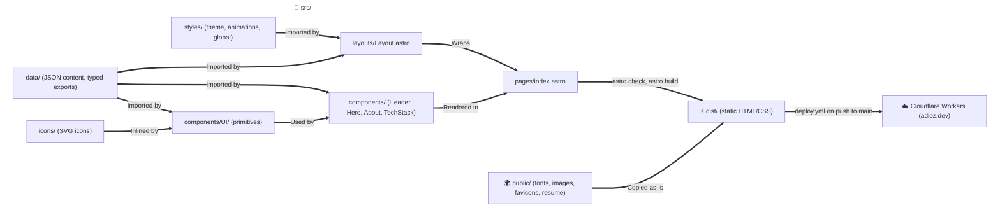

# System Architecture

## Overview

This portfolio is a statically generated site built with Astro and Tailwind CSS v4. Every page is pre-rendered at build time into static HTML and CSS; the only client-side JavaScript is a short inline script for the mobile menu. GitHub Actions deploy `main` to Cloudflare Workers as static assets, served at `adioz.dev`. The colors follow the device's light or dark color scheme.

## Architecture Flow

## 1. Pages, Components and Data

- **`src/pages/index.astro`**: The only route (`/`). It renders `Header`, then `Hero`, `AboutSection` and `TechStackSection` inside `<main>`, inside `Layout`.
- **`src/layouts/Layout.astro`**: The HTML shell. Its `title`, `description`, `image` and `imageAlt` props default to `profile.json` (title `<name> | <role>`) and `site.json`. It sets the canonical URL and the Open Graph and Twitter card tags as absolute URLs from `site` in `astro.config.mjs`, a `theme-color` for each color scheme, preloads the Montserrat and JetBrains Mono fonts, links the SVG and ICO favicons, and imports `global.css`.
- **`src/components/Header/`**: The site header, built from `navigation.json` and `profile.json`:
  - `Header.astro`: a sticky bar across the top of the page with a translucent, blurred background. It holds the brand link, the section links (from 760px) and the menu button (below 760px).
  - `BrandLogo.astro`: a link to the top of the page with the logo mark, `public/favicon.svg` (the same file as the site icon), and `Profile.name` as a lowercase wordmark.
  - `NavLinks.astro`: the section links followed by the contact link, as an inline `bar` (the contact link styled as a button) or a stacked `drawer` list.
  - `MobileMenu.astro`: the menu button and the menu drawer, an HTML popover. While closed, the drawer is not rendered, so keyboard and screen-reader users cannot reach its links; `Escape` or a click outside closes it, and the browser exposes the button's expanded state. A short inline script closes the drawer when one of its links is followed or the viewport widens to 760px.
- **`src/components/Hero/`**: The first screen, built from `profile.json`, `terminal.json` and `stats.json`:
  - `Hero.astro`: the availability badge, the name and gradient headline, the role and specialty, the summary, the call-to-action buttons (the first one primary), the resume download link and the social links, beside the terminal from 1040px, with `StatBanner` underneath.
  - `SocialLinks.astro`: `Profile.links` as icon links named by their titles; `https:` links open in a new tab.
  - `Terminal.astro`: the window title, the lines as output, and an input line with a blinking caret, in one component. CSS animation delays print the lines 400ms apart after 600ms; the text is in the HTML from the start, and with reduced motion every line shows at once. The terminal keeps the dark palette in both color schemes (`data-scheme="dark"`) and is the only text set in JetBrains Mono.
- **`src/components/About/`**: The about section, built from `about.json`:
  - `AboutSection.astro`: a `Section` with the bio paragraphs under the headline, a `CoreFocusCard` per pillar (one column, two from 760px, three from 1040px), and the philosophy statement after the cards.
  - `CoreFocusCard.astro`: one pillar's icon, title, description and tags.
- **`src/components/TechStack/`**: The tech stack section, built from `techStack.json`:
  - `TechStackSection.astro`: a `Section` with the skills and the tool categories. The categories form two columns from 760px; from 1040px the skills sit beside them and stay in view below the sticky header while the categories scroll.
  - `SkillBar.astro`: a skill's label and level as a `<dt>`/`<dd>` pair, and a bar filled to its percent that is hidden from assistive technology.
  - `TagCloud.astro`: a category's name as an `<h3>` and its tools as chip badges.
- **`src/components/UI/`**: Reusable primitives that render static HTML:
  - `Button.astro`: a `primary` (cyan-to-violet gradient) or `ghost` (outlined) button with an optional trailing icon. With `href` it renders an `<a>`, and `external` opens the link in a new tab with `rel="noopener noreferrer"`; without `href` it renders a `<button>` whose `type` defaults to `button`.
  - `Badge.astro`: a `tag` (outlined label), `chip` (tool label) or `status` (pill with a pulsing success dot).
  - `Emphasis.astro`: renders text with each `**` pair as `<strong>`; an unpaired `**` fails the build.
  - `Icon.astro`: inlines `src/icons/<name>.svg` at a given pixel size. The icon is hidden from assistive technology unless it has a `label`, and a name with no SVG file fails the build.
  - `StatCard.astro`: one `stats.json` entry as a `<dt>` label and a `<dd>` value with its suffix, shown value first.
  - `StatBanner.astro`: a `<dl>` of `StatCard`s, every `stats.json` entry by default. It has one column on narrow screens, two from 420px (an odd last stat spans both), and one column per stat from 760px.
  - `Section.astro`: a numbered page section: the `<section>` with its id and accessible name, the page-width container, and a `SectionHeader` numbered by `sectionNumber`, with the paragraphs of its `intro` slot under the title.
  - `SectionHeader.astro`: a section's number and name (for example `01 — Core Engineering Focus`), its `<h2>` title and an optional intro, given as a string or as paragraphs in its default slot.
- **`src/icons/`**: One SVG per icon name used in the data (`LinkItem.icon`). Each file keeps only its path data, filled with `currentColor`, so an icon takes the color of the text around it. `LICENSE.md` lists the sources: Bootstrap Icons (MIT) and Simple Icons (CC0).
- **`src/data/types.ts`**: TypeScript interfaces for the portfolio content: profile, header navigation, stats, terminal lines, about, tech stack, experience, projects, contact and footer. Every type holds JSON-compatible values only, and every link is a `LinkItem` with a title, URL and icon name. In `Profile.summary` and `ExperienceItem.highlights`, text inside `**` pairs marks strong emphasis, which `Emphasis.astro` renders.
- **`src/data/*.json`**: The portfolio content, one file per type: `profile.json` (`Profile`: the name, role, hero copy, call-to-action, resume and social links), `navigation.json` (`Navigation`: the section links, the contact link and the accessible names of the navigation landmark and menu button), `stats.json` (`StatItem[]`, the only place the headline metric values live), `terminal.json` (`TerminalContent`: the window title and the lines), `about.json` (`AboutContent`: the section id and label, the headline, bio, pillars with their icons, and the philosophy), `techStack.json` (`TechStack`: the section id, label, headline and intro, the proficiency bars, and tools grouped by category), `experience.json` (`ExperienceItem[]`), `projects.json` (`ProjectItem[]`), `contact.json` (`ContactContent`), `footer.json` (`FooterContent`) and `site.json` (`SiteMeta`: the default meta description and Open Graph image). The experience, projects, stats and tech stack categories follow the resume in `public/resume.pdf`.
- **`src/data/index.ts`**: Exports each JSON file typed by its interface, so `astro check` (run by `npm run build` and CI) rejects a file whose structure no longer matches. JSON imports type strings as `string`, so it checks `TerminalLine.kind` when it loads and throws on an unknown kind; it also throws on a skill percent that is not an integer from 0 to 100. `Layout.astro` imports `profile` and `site` from it, so either error fails the build. It also exports `sectionNumber(id)`, a section's position among the `navigation.json` links from 1, which throws when no link targets the section.

## 2. Styling

Tailwind CSS v4 runs through the `@tailwindcss/vite` plugin registered in `astro.config.mjs`; there is no `tailwind.config.*` file.

- **`src/styles/theme.css`**: Design tokens in an `@theme` block (colors, fonts, radius, page width, header height, easing, breakpoints) for the dark scheme, a `prefers-color-scheme: light` block that overrides the color tokens for the light scheme, and a `[data-scheme="dark"]` scope that keeps the dark color tokens in both schemes. Text colors meet WCAG AA (4.5:1) in both schemes. Each token is a CSS variable on `:root` and drives a Tailwind utility.
- **`src/styles/animations.css`**: Keyframes exposed as `animate-*` utilities, the `[data-reveal]` scroll transition, and reduced-motion rules.
- **`src/styles/global.css`**: Imports Tailwind and both files above, declares `@font-face` rules for the self-hosted fonts, and sets base element styles, including `color-scheme: light dark` and a `scroll-padding-top` of the header height, so a section reached through a link starts below the sticky header.
- **Component styles**: the components in `src/components/` use scoped `<style>` blocks that read the tokens as CSS variables (for example `var(--color-ink)`), so they follow both color schemes. Their media queries use the `--breakpoint-*` widths.

## 3. Static Assets

`public/` is served as-is: the self-hosted Montserrat and JetBrains Mono variable fonts with their licenses, the avatar and Open Graph image, the SVG and ICO favicons, and the resume PDF.

## 4. Rendering

The site is pre-rendered at build time (SSG). `npm run build` runs `astro check` (strict TypeScript) and then `astro build`, writing static HTML and CSS to `dist/`.

## 5. Tooling

- **Formatting:** Prettier with the Astro plugin (`npm run format`, `npm run format:check`).
- **CI:** `.github/workflows/ci.yml` runs the format check, type check and build on pull requests into `main`; `deploy.yml` also runs it before every deployment.
- **Deploy:** `.github/workflows/deploy.yml` runs on every push to `main` and calls `ci.yml` first. Once that passes, the deploy job builds the site and runs `wrangler deploy` through the official Wrangler action (Wrangler 4.147.0), authenticating with the `CLOUDFLARE_API_TOKEN` and `CLOUDFLARE_ACCOUNT_ID` repository secrets. It writes the production URL to the run summary. Deployments never overlap: a newer push waits for the running deployment to finish.
- **Wrangler:** `wrangler.toml` configures the `adioz-dev` Cloudflare Worker to serve `dist/` as static assets at the `adioz.dev` Custom Domain, with the `workers.dev` URL and preview URLs disabled; `npx wrangler dev` serves the build locally.
- **Domain:** the `adioz.dev` zone is on Cloudflare DNS. Deploying the Worker creates the Custom Domain's DNS record and certificate. `www.adioz.dev` has a proxied placeholder record (`AAAA 100::`) and a Redirect Rule that sends `https://www.*` to `https://${1}` with a 301. Always Use HTTPS redirects plain-HTTP requests to HTTPS before that rule runs, and the edge accepts TLS 1.2 and 1.3 only. The Email Routing MX and TXT records forward `contact@adioz.dev`.
