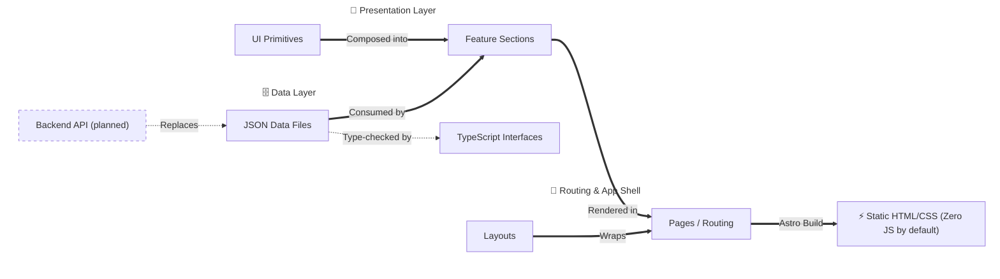

# System Architecture

## Overview

This portfolio is engineered as a high-performance, statically generated site using Astro. The core architectural philosophy is **strict decoupling of data from presentation**: the site renders from a typed data layer that starts as local JSON and is later served by a backend API, so the data source can change without touching the UI. This keeps the system maintainable, resource-efficient, and ready for seamless scaling and integrations.

## Architecture Flow

## 1. The Data Layer (Content Decoupling)

All portfolio content (experience, projects, skills, contact info) is isolated in [data directory](../src/data) as JSON files.

* **Why?** It acts as a mock API. By utilizing TypeScript interfaces (`types.ts`), the application enforces a strict schema for all content.
* **Single Source of Numbers:** Headline metrics (years of experience, throughput, uptime, latency) live only in `src/data/stats.json`. Components, docs, and the README never restate them.
* **Migration Ready:** Each JSON file has the shape of the planned backend API's response, so swapping local JSON for the API requires zero component changes. You simply update the data-fetching logic in the parent pages.

## 2. Component Hierarchy

The UI is built using a modular, composition-based approach:

* **Layouts (`src/layouts/`)**: Global shells handling meta tags, fonts, and global CSS.
* **UI Primitives (`src/components/UI/`)**: Dumb, reusable components (Buttons, Badges, Cards) that accept props and emit UI. No business logic.
* **Feature Sections (`src/components/*/`)**: Smart components (e.g., `ExperienceSection`, `ProjectsSection`) that consume the data layer and orchestrate UI primitives. The Hero terminal prints scripted lines from the data layer and keeps its input and output in one component, which later becomes the client for the live chat tool.

## 3. Performance & Rendering

In alignment with resource-aware engineering:

* **Zero-JS by Default:** Astro ships zero client-side JavaScript by default. Interactions are handled via standard HTML/CSS where possible; small scripts (Astro islands) cover only the mobile menu, the terminal, and scroll effects CSS cannot express, and all content stays readable with JavaScript disabled.
* **Build-Time Generation (SSG):** The site is pre-rendered into static HTML/CSS during the build step, eliminating server-side rendering latency and reducing hosting compute requirements to zero.

## 4. Styling Strategy

Global design tokens, CSS resets, and Tailwind CSS v4 entry points live in `src/styles/`, while component-specific styles are scoped locally within `.astro` files. Tailwind v4 is configured in CSS: fonts, colors, and breakpoints are declared in an `@theme` block in `theme.css`, which `global.css` imports, and there is no `tailwind.config.*` file. This prevents global CSS leakage and bloat, ensuring that only the CSS required for the rendered page is shipped to the client.

## 5. Planned Services

* **Backend API:** A service on a small VPS (Docker + Caddy) serves realistic portfolio data and replaces the JSON files in the data layer.
* **Terminal Chat:** The Hero terminal connects to that service and becomes a real chat tool.
